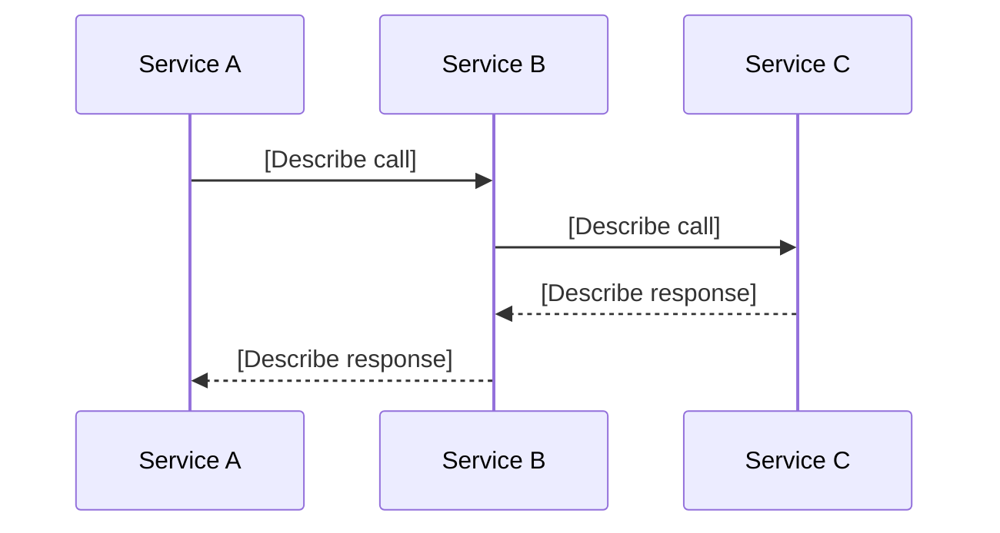

# Large Tech Spec Template

A comprehensive template for AI agents to generate specs for **large tasks** (8+ story points). Use this for epics, cross-team initiatives, new services, or system redesigns that involve multiple workstreams, stakeholders, and rollout phases.

---

## How to Use This Template

<aside>
💡

**For AI Agents:** Fill in every section below. Replace `[brackets]` with specifics. For large specs, **separate the business spec from the technical spec** — they serve different audiences. Use mermaid diagrams for all cross-service flows. If a section doesn't apply, write "N/A — [reason]".

</aside>

<aside>
🧑‍💻

**For Engineers:** Large specs should be reviewed in stages, not all at once. Start with Overview and Requirements, align on scope, then review Technical Design separately. Pay special attention to **Dependencies**, **Assumptions**, and **Rollout Plan**.

</aside>

---

# Part 1: Business Spec

## 1. Overview

**What:** [Two to three sentences describing the initiative and its deliverables.]

**Why:** [Business motivation — revenue impact, user pain, technical debt, compliance, etc.]

**Context:** [What exists today, what's the gap, what triggered this work, and any prior attempts.]

**Requester:** [Who requested this and where]

**Stakeholders:** [Product, engineering, design, ops — who needs to sign off]

---

## 2. Goals & Success Metrics

**Primary goal:** [The single most important outcome.]

**Success metrics:**

| Metric | Current | Target | How to Measure |
| --- | --- | --- | --- |
| [e.g., Upload success rate] | [e.g., 72%] | [e.g., 95%] | [Dashboard / query] |
| [e.g., Integration time] | [e.g., 4 weeks] | [e.g., 1 week] | [Tracking] |

---

## 3. Requirements

### Functional Requirements

1. [Requirement 1 — describe the expected behavior from the user's or system's perspective]
2. [Requirement 2]
3. [Requirement 3]

### Acceptance Criteria

Write each criterion as a verifiable goal — describe the action and expected outcome.

- [ ]  [e.g., Trigger async failure → error report Excel generated and sent to customer within 5 minutes]
- [ ]  [e.g., Run full regression suite → all tests pass]
- [ ]  [e.g., Load test with 100 concurrent uploads → p99 latency < 2s]

### Non-Functional Requirements

- **Performance:** [Latency, throughput, concurrency constraints]
- **Security:** [Auth, access control, data sensitivity, encryption]
- **Observability:** [Logging, monitoring, alerting, dashboards]
- **Scalability:** [Expected load growth, capacity planning]
- **Compliance:** [Regulatory or policy requirements]

---

## 4. Scope

- **In scope:** [Bullet list of what this spec covers]
- **Out of scope:** [Bullet list of what this spec explicitly does NOT cover]
- **Must:**
    - [Required patterns/conventions]
- **Must not:**
    - [No new dependencies unless specified]
    - [Don't modify unrelated code]
    - [Don't refactor existing code]
    - [No features beyond what was asked]
    - [No abstractions for single-use code]
    - [No error handling for impossible scenarios]

---

## 5. Assumptions & Tradeoffs

<aside>
⚠️

**For AI Agents:** State assumptions explicitly. If multiple approaches exist, present them — don't pick silently. If a simpler approach exists, say so.

</aside>

**Assumptions:**

- [What you believe to be true that hasn't been explicitly confirmed]
- [e.g., "The partner team will deliver the IAM changes by end of Q1"]

**Alternative approaches considered:**

| Approach | Pros | Cons | Why rejected / chosen |
| --- | --- | --- | --- |
| [Approach A] | [Pros] | [Cons] | [Reason] |
| [Approach B] | [Pros] | [Cons] | [Reason] |

**Tradeoffs accepted:**

- [What the chosen approach gives up]

---

## 6. Dependencies

| Dependency | Team / Service | Status | Risk if Delayed |
| --- | --- | --- | --- |
| [e.g., IAM scoping model] | [Platform team] | [🔴 Not started / 🟡 In progress / 🟢 Ready] | [Blocks partner onboarding] |
| [e.g., Notification service API] | [Core Experiences] | [Status] | [Impact] |

---

# Part 2: Technical Spec

## 7. Architecture

**Relevant files:**

- `path/to/file.kt` — [what it does]
- `path/to/other.kt` — [why it matters]

**Patterns to follow:**

- [Existing convention to match, with example file]

**Key decisions already made:**

- [Tech choices, libraries, approaches locked in]

[Describe the system architecture. Include a mermaid diagram for the high-level component view and sequence diagrams for key flows.]



---

## 8. API Contracts / Interface Changes

**New or Modified Endpoints:**

| Method | Path / RPC | Request | Response | Notes |
| --- | --- | --- | --- | --- |
| [gRPC/REST/GraphQL] | [endpoint name] | [key fields] | [key fields] | [notes] |

**Request Schema:**

```
[Define the request message / body structure]
```

**Response Schema:**

```
[Define the response message / body structure]
```

---

## 9. Data Model Changes

[Describe any new tables, columns, indexes, or migrations.]

```sql
-- New tables / alterations
```

---

## 10. Key Design Decisions

| Decision | Options Considered | Chosen | Rationale |
| --- | --- | --- | --- |
| [Decision 1] | [Option A, Option B] | [Chosen option] | [Why] |

---

## 11. Data/Format Mapping

[If the change involves consuming data from one source and producing output in a different format, document the mapping explicitly.]

| Source Field | Target Field | Transformation | Notes |
| --- | --- | --- | --- |
| [field] | [field] | [none / convert / derive] | [notes] |

---

## 12. Edge Cases & Error Handling

Only include scenarios that are **realistically possible** given the requirements. Do not invent hypothetical edge cases or add error handling for impossible scenarios.

| Scenario | Expected Behavior |
| --- | --- |
| [Edge case 1] | [What should happen] |
| [Edge case 2] | [What should happen] |

---

## 13. Feature Flags & Rollout Plan

**Feature Flag:** [Flag name, e.g., `enable-partner-api-v2`]

**Rollout phases:**

| Phase | What Ships | Gate / Criteria | Rollback Plan |
| --- | --- | --- | --- |
| Phase 1 | [e.g., New endpoint behind flag, internal testing] | [e.g., All integration tests pass] | [Disable flag] |
| Phase 2 | [e.g., Enable for 1 pilot customer] | [e.g., No errors in 48h] | [Disable flag per company] |
| Phase 3 | [e.g., GA rollout] | [e.g., Success rate > 95%] | [Percentage rollback via Growthbook] |

---

## 14. Tasks

Break into tasks that:

- Can each be completed in one session
- Have a clear verify step
- Are safe to commit independently

### T1: [Noun phrase — what gets built]

**Requirement:** [The requirement that this task solves or partially solves]

**Do:** [Specific changes]

**Files:**

- `path/to/file`
- `path/to/file-test`

**Verify:** `command` or "Manual: [check]"

### T2: [Noun phrase — what gets built]

**Requirement:** [The requirement that this task solves or partially solves]

**Do:** [Specific changes]

**Files:**

- `path/to/file`
- `path/to/file-test`

**Verify:** `command` or "Manual: [check]"

### T3: [Noun phrase — what gets built]

*[Repeat pattern as needed…]*

---

## Done

[End-to-end verification after all tasks]

- [ ]  `build/test command passes`
- [ ]  Manual: [what to verify in UI/API]
- [ ]  No regressions in [related area]
- [ ]  Success metrics baseline captured
- [ ]  Monitoring / dashboards in place

---

## 15. Open Questions

| # | Question | Owner | Status | Answer |
| --- | --- | --- | --- | --- |
| 1 | [Unresolved question] | [Who should answer] | 🔴 Open |  |
| 2 | [Another question] | [Who should answer] | 🟢 Resolved | [Answer] |

---

## 16. References

- [Link to related specs, PRDs, Slack threads, or prior art]
- [Link to relevant code / PRs]
- [Link to related tickets]
