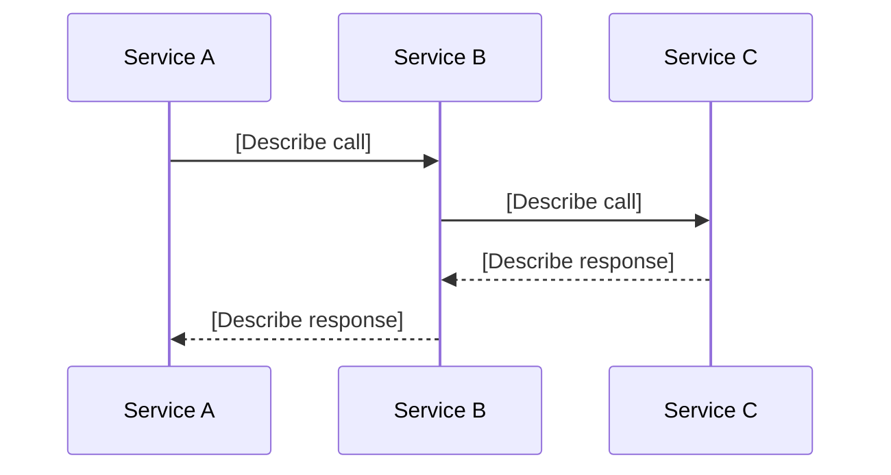

# Medium Tech Spec Template

A structured template for AI agents to generate complete technical specifications for **medium-sized tasks** (3–8 story points). Use this when the work involves a well-scoped feature, cross-service change, or meaningful new capability — but not a full epic or system redesign.

---

## How to Use This Template

<aside>
💡

**For AI Agents:** When given a requirement, fill in every section below. Replace placeholder text in `[brackets]` with specifics. Remove sections only if genuinely not applicable — prefer writing "N/A — [reason]" to keep the structure visible. Use mermaid diagrams where system interactions are involved.

</aside>

<aside>
🧑‍💻

**For Engineers:** After the AI generates the spec, review each section critically. Pay special attention to **Edge Cases**, **Format/Data Mapping**, and **Open Questions** — these are where AI-generated specs most often miss important details.

</aside>

---

## 1. Overview

**What:** [One or two sentences describing what this change does.]

**Why:** [Why this change is needed — the business or technical motivation.]

**Context:** [Brief background — what exists today, what's the gap, and what triggered this work.]

**Relevant files:**

- `path/to/file.kt` — [what it does]
- `path/to/other.kt` — [why it matters]

**Patterns to follow:**

- [Existing convention to match, with example file]

**Key decisions already made:**

- [Tech choices, libraries, approaches locked in]

**Scope:**

- **In scope:** [Bullet list of what this spec covers]
- **Out of scope:** [Bullet list of what this spec explicitly does NOT cover]
- **Must:**
    - [Required patterns/conventions]
- **Must not:**
    - [No new dependencies unless specified]
    - [Don't modify unrelated code]
    - [Don't refactor existing code]
    - [No features beyond what was asked]
    - [No abstractions for single-use code]
    - [No error handling for impossible scenarios]

**Requester:** [Who requested this and where — e.g., Nick via Slack, product brief, etc.]

---

## 2. Requirements

### Functional Requirements

1. [Requirement 1 — describe the expected behavior from the user's or system's perspective]
2. [Requirement 2]
3. [Requirement 3]

### Acceptance Criteria

Write each criterion as a verifiable goal — describe the action and expected outcome.

- [ ]  [e.g., Call endpoint with failed job ID → returns Excel blob with validation errors]
- [ ]  [e.g., Submit empty payload → returns 400 with field-level error messages]
- [ ]  [e.g., Run `./gradlew test` → all new and existing tests pass]

### Non-Functional Requirements

- **Performance:** [Any latency, throughput, or resource constraints]
- **Security:** [Auth, access control, data sensitivity considerations]
- **Observability:** [Logging, monitoring, alerting requirements]

### Assumptions & Tradeoffs

<aside>
⚠️

**For AI Agents:** State assumptions explicitly. If multiple approaches exist, present them — don't pick silently. If a simpler approach exists, say so.

</aside>

**Assumptions:**

- [What you believe to be true that hasn't been explicitly confirmed — e.g., "The bulk-upload-service already stores validation errors per row"]
- [e.g., "The existing Excel template can be reused without modification"]

**Alternative approaches considered:**

| Approach | Pros | Cons | Why rejected / chosen |
| --- | --- | --- | --- |
| [Approach A] | [Pros] | [Cons] | [Reason] |
| [Approach B] | [Pros] | [Cons] | [Reason] |

**Tradeoffs accepted:**

- [What the chosen approach gives up — e.g., "Slightly more complex parsing in exchange for reusing the existing Excel template"]

---

## 3. Technical Design

### Architecture

[Describe which services are involved and how they interact. Include a mermaid diagram for any cross-service or multi-step flows.]



### API Contracts / Interface Changes

**New or Modified Endpoints:**

| Method | Path / RPC | Request | Response | Notes |
| --- | --- | --- | --- | --- |
| [gRPC/REST/GraphQL] | [endpoint name] | [key fields] | [key fields] | [notes] |

**Request Schema:**

```
[Define the request message / body structure]
```

**Response Schema:**

```
[Define the response message / body structure]
```

### Data Model Changes

[Describe any new tables, columns, indexes, or migrations. Include SQL if applicable.]

```sql
-- Example:
-- ALTER TABLE ... ADD COLUMN ...;
-- CREATE INDEX ...;
```

### Key Design Decisions

| Decision | Options Considered | Chosen | Rationale |
| --- | --- | --- | --- |
| [Decision 1] | [Option A, Option B] | [Chosen option] | [Why] |
| [Decision 2] | [Option A, Option B] | [Chosen option] | [Why] |

### Data/Format Mapping

[If the change involves consuming data from one source and producing output in a different format, document the mapping explicitly.]

| Source Field | Target Field | Transformation | Notes |
| --- | --- | --- | --- |
| [field] | [field] | [none / convert / derive] | [notes] |

---

## 4. Edge Cases & Error Handling

Only include scenarios that are **realistically possible** given the requirements. Do not invent hypothetical edge cases or add error handling for impossible scenarios.

| Scenario | Expected Behavior |
| --- | --- |
| [Edge case 1 — e.g., empty input, missing data] | [What should happen] |
| [Edge case 2 — e.g., service unavailable, timeout] | [What should happen] |
| [Edge case 3 — e.g., partial failure, duplicate request] | [What should happen] |

---

## 5. Feature Flags & Rollout

**Feature Flag:** [Flag name if applicable, e.g., `enable-async-error-report`]

**Rollout Strategy:** [How to roll out — e.g., company-gated via Growthbook, percentage rollout, manual enablement]

**Fallback Plan:** [What happens if we need to roll back]

---

## 6. Tasks

Break into tasks that:

- Can each be completed in one session
- Have a clear verify step
- Are safe to commit independently

### T1: [Noun phrase — what gets built]

**Requirement:** [The requirement that this task solves or partially solves]

**Do:** [Specific changes]

**Files:**

- `path/to/file`
- `path/to/file-test`

**Verify:** `command` or "Manual: [check]"

### T2: [Noun phrase — what gets built]

**Requirement:** [The requirement that this task solves or partially solves]

**Do:** [Specific changes]

**Files:**

- `path/to/file`
- `path/to/file-test`

**Verify:** `command` or "Manual: [check]"

### T3: [Noun phrase — what gets built]

*[Repeat pattern as needed…]*

---

## Done

[End-to-end verification after all tasks]

- [ ]  `build/test command passes`
- [ ]  Manual: [what to verify in UI/API]
- [ ]  No regressions in [related area]

---

## 7. Open Questions

| # | Question | Owner | Status | Answer |
| --- | --- | --- | --- | --- |
| 1 | [Unresolved question] | [Who should answer] | 🔴 Open |  |
| 2 | [Another question] | [Who should answer] | 🟢 Resolved | [Answer] |

---

## 8. References

- [Link to related specs, PRDs, Slack threads, or prior art]
- [Link to relevant code / PRs]
- [Link to related tickets]
